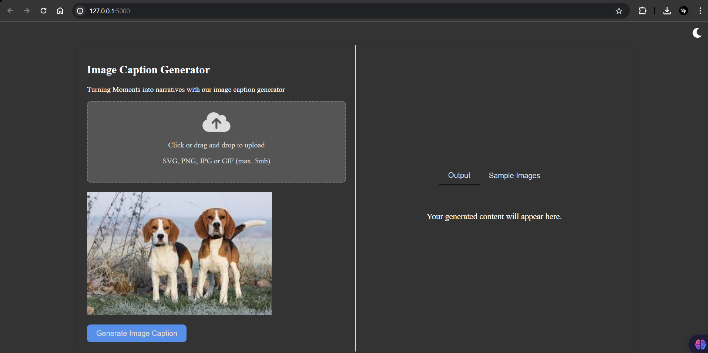
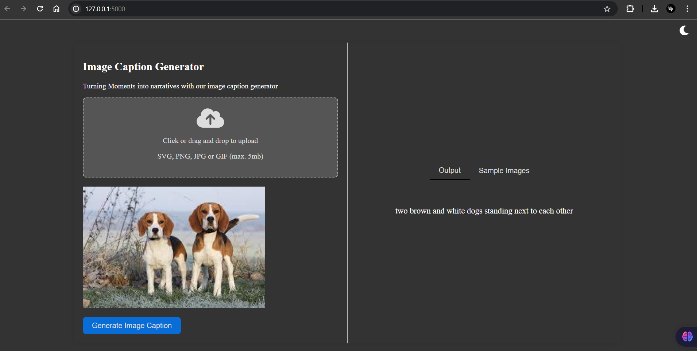

# Image Caption Generator

This project is an Image Caption Generator web application built using Flask, HTML, and JavaScript. It leverages a pretrained VisionEncoderDecoderModel from Hugging Face to generate captions for uploaded images. Users can either upload their own images or use sample images provided in the application to generate captions.

## Features

- Image Upload: Users can upload their own images through a drag-and-drop interface or by clicking to select files.
- Sample Images: Users can experiment with sample images provided in the application to see how the caption generator works.
- Image Preview: Uploaded images or selected sample images are displayed in a preview section before generating captions.
- Caption Generation: Captions are generated for the uploaded or selected sample images using a pretrained VisionEncoderDecoderModel.
- Dark Mode/Light Mode: Users can switch between dark mode and light mode for a better viewing experience, with a toggle button featuring sun and moon icons.
- Responsive Design: The application has a responsive design that works well on various screen sizes.

## Getting Started

### Prerequisites

Ensure you have the following installed:

- Python 3.7+
- pip

### Installation

1. Clone the repository:
    ```sh
    git clone https://github.com/Naresh-19/image-caption-generator.git
    cd image_caption
    ```

2. Install the required Python packages:
    ```sh
    pip install -r requirements.txt
    ```

3. Download and set up the pretrained model:
    ```sh
    from transformers import VisionEncoderDecoderModel, ViTImageProcessor, AutoTokenizer
    import torch

    model = VisionEncoderDecoderModel.from_pretrained("nlpconnect/vit-gpt2-image-captioning")
    feature_extractor = ViTImageProcessor.from_pretrained("nlpconnect/vit-gpt2-image-captioning")
    tokenizer = AutoTokenizer.from_pretrained("nlpconnect/vit-gpt2-image-captioning")

    device = torch.device("cuda" if torch.cuda.is_available() else "cpu")
    model.to(device)
    ```

4. Ensure you have a folder named `uploads` in the root directory:
    ```sh
    mkdir uploads
    ```

### Running the Application

1. Start the Flask server:
    ```sh
    python app.py
    ```

2. Open your browser and navigate to `http://127.0.0.1:5000/`.

### Project Structure

- `app.py`: The main Flask application file.
- `templates/index.html`: The HTML file for the frontend.
- `static`: Directory for static files (e.g., CSS, JavaScript, images).
- `uploads`: Directory where uploaded images are stored.
- `requirements.txt`: Python package dependencies.

### Usage

1. **Upload an Image**: Click on the upload box to select an image file from your computer or drag and drop an image into the upload box. Supported formats are SVG, PNG, JPG, and GIF (max. 5MB).
2. **Generate Caption**: Once the image is uploaded, click the "Generate Image Caption" button to generate a caption for the image.
3. **View Output**: The generated caption will be displayed in the output section.
4. **Use Sample Images**: Click on the "Sample Images" tab and select any sample image to generate captions.

### Sample Images

You can experiment with sample images provided in the application. The sample images are located in the `static` folder.

### Example

1. Upload an image:
   

2. Generate a caption:
   

### Contributing

Contributions are welcome! Please feel free to submit a Pull Request.

### License

This project is licensed under the MIT License - see the [LICENSE](LICENSE) file for details.

### Acknowledgments

- [Hugging Face](https://huggingface.co/) for the pretrained models and libraries.
- [Flask](https://flask.palletsprojects.com/) for the web framework.
- [PIL](https://pillow.readthedocs.io/en/stable/) for image processing.

